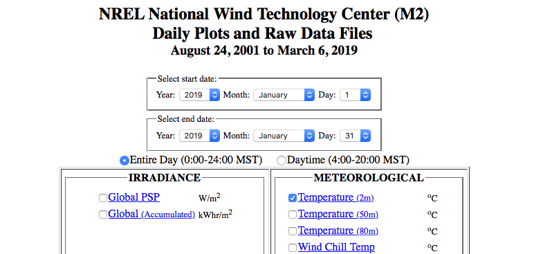
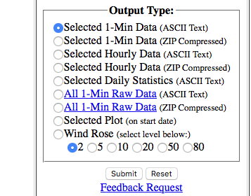
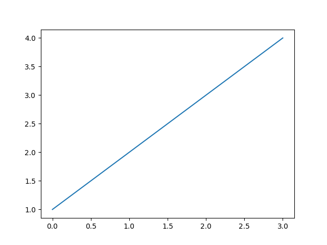
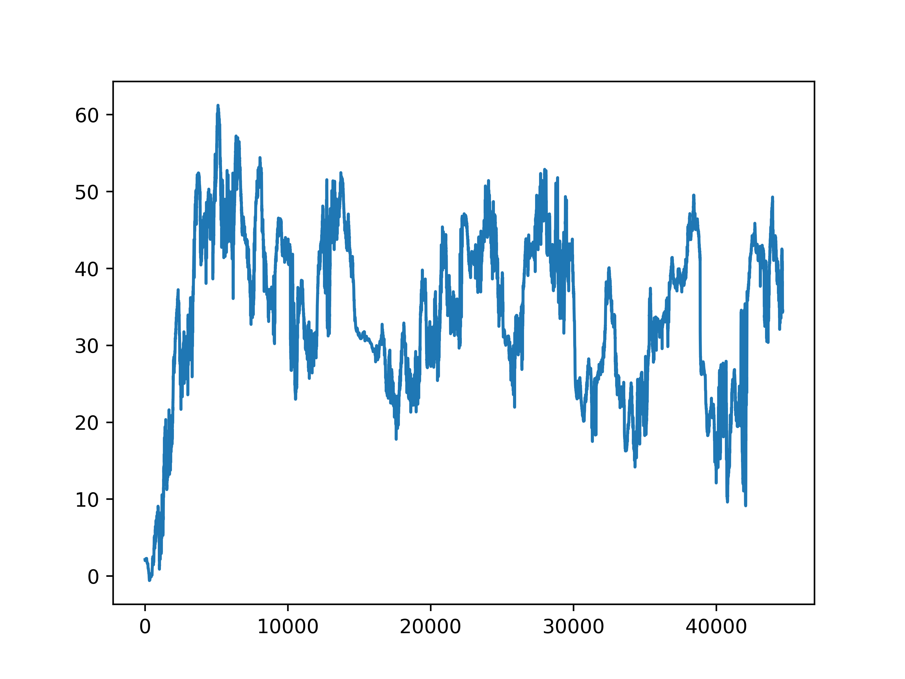
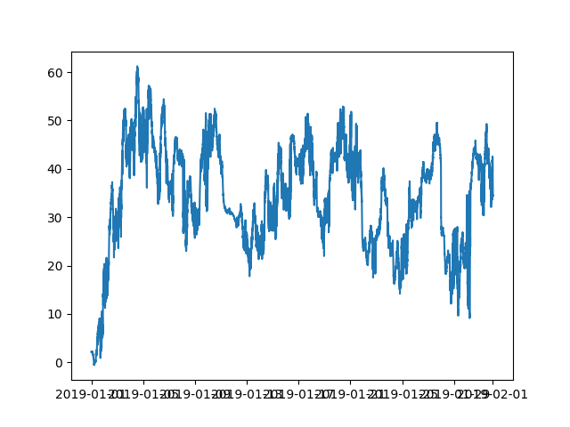
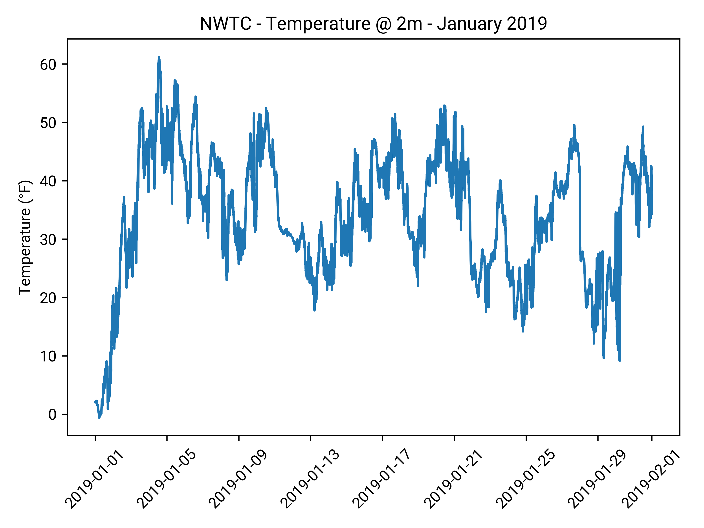

This the first part in a multipart series on real world data visualization with python and matplotlib. Links to other posts will be added as they are created.

[Python](https://www.python.org/) and [matplotlib] are powerful tools for parsing and visualizing data. Python is an easy to use scripting language with many awesome tools for working with various types of data. Matplotlib, in my opinion, is the most comprehensive and easiest to use data visualization tool out there. Together they can help extract meaning from data.

# Finding Data

There are [petabytes](https://en.wikipedia.org/wiki/Petabyte) of data that exist in the world today, so finding some data is not a problem. But finding the right data for you is the challenge.

When you are looking for data to visualize the data set you choose needs:

1. Data you are familiar with and understand
   - This helps immensely when sanitizing the data. If you don't know what a bogus value looks like your plot can convey the wrong information, or just look wrong.

2. An easily parseable data format like [`json`](https://en.wikipedia.org/wiki/JSON) or [`csv`](https://en.wikipedia.org/wiki/Comma-separated_values)
    - Anything in html, xml, or other formats will need to be processed, which can be difficult and time consuming (it is possible, just outside the scope of this post)

3. Customizable data intervals
    - This allows you to iterate quickly on a small data set before working with a larger data set, which can be slow.

Given these suggestions we are going to start with a data set that I am familiar with, [weather data][weather_data] from the [National Renewable Energy Lab](https://www.nrel.gov/) [National Wind Technology Center](https://www.nrel.gov/nwtc/) in [Boulder Colorado](https://en.wikipedia.org/wiki/Boulder,_Colorado).

# Downloading NWTC Weather Data

From [the NWTC website](weather_data) we are going to download temperature data (Temperature (2m)) from January 2019.



Select the `Selected 1-Min Data (ZIP Compressed)` option and hit submit. Unzip the downloaded file, move it to the desired directory and rename it to `2019-01-nwtc-temp-2m.csv`.



For convience you can download this data [here](/blogfiles/2019-01-nwtc-temp-2m.csv).

# Inspecting

Lets go ahead and see what this data looks like. We can use the [`head`](https://en.wikipedia.org/wiki/Head_(Unix)) command to see the first part of the file:

```sh
$ head 2019-01-nwtc-temp-2m.csv
DATE (MM/DD/YYYY),MST,Temperature @ 2m [deg C]
1/1/2019,00:00,-16.59
1/1/2019,00:01,-16.6
1/1/2019,00:02,-16.61
1/1/2019,00:03,-16.62
1/1/2019,00:04,-16.63
1/1/2019,00:05,-16.64
1/1/2019,00:06,-16.65
1/1/2019,00:07,-16.66
1/1/2019,00:08,-16.66
```

From this we can see the shape of the data. There are 3 columns, the date, the time in [MST](https://en.wikipedia.org/wiki/Mountain_Time_Zone) and the temperature is celsius degrees. 

We can count the number of rows with the [wc](https://linux.die.net/man/1/wc) (word count) utility, passing the `-l` argument to get the number of lines:

```sh
$ wc -l 2019-01-nwtc-temp-2m.csv
44641 2019-01-nwtc-temp-2m.csv
```

There are 60 minutes in an hour, 24 hours a day, and 31 days in January which works out to (60 * 24 * 31) 44640 minutes. Add in an extra row for the titles and 44641 adds up, so lets proceed.

# Parsing Data

To get a feel for parsing lets find the min and max temperatures in degrees farenheit.

First lets read the csv rows into an array using the built-in [python csv package](https://docs.python.org/3/library/csv.html)


```python
import csv

data = []
with open("2019-01-nwtc-temp-2m.csv") as datafile:
    reader = csv.reader(datafile)
    for row in reader:
        data.append(row)

print(data[1])
```

That prints:

```sh
['1/1/2019', '00:00', '-16.59']
```

Notice that the type for the temperature is a string.

```python
print(type(data[1][2]))
```

```sh
<class 'str'>
```

Lets convert it to a float so we can do some math...

```python
for row in data:
    row[2] = float(row[2])
```

```sh
Traceback (most recent call last):
  File "parse_data.py", line 12, in <module>
    row[2] = float(row[2])
ValueError: could not convert string to float: 'Temperature @ 2m [deg C]'
```

Oops, we need to remove the labels in the first row.

```python
data = data[1:-1]

for row in data:
    row[2] = float(row[2])

print(type(data[1][2]))
```

```sh
<class 'float'>
```

Now that we have some numbers lets convert the temperature to farenheit:

```python
def convert_celsius_to_farenheit(celsius_deg):
    return (celsius_deg * 9.0 / 5.0) + 32.0

temperature_data = []
for row in data:
    temperature_data.append(convert_celsius_to_farenheit(float(row[2])))

print(temperature_data[0])
```

```sh
2.137999999999998
```

Now lets find the min and max temperatures:

```python
min_temp = temperature_data[0]
max_temp = min_temp
for temp in temperature_data:
    if temp < min_temp:
        min_temp = temp

    if temp > max_temp:
        max_temp = temp

print("In January 2019 the temperature ranged from {} to {}".format(min_temp, max_temp))
```

```sh
In January 2019 the temperature ranged from -0.5799999999999983 to 61.232
```

It works! But lets fix the temperature format:

```python
def format_temp(input):
    return "{:.0f}°F".format(input)


print(
    "In January 2019 the temperature ranged from {} to {}".format(
        format_temp(min_temp), format_temp(max_temp)
    )
)
```

```sh
In January 2019 the temperature ranged from -1°F to 61°F

```

Now lets plot the data...

# First steps with [matplotlib]

Go ahead and install [matplotlib] and [numpy].

```sh
$ pip install matplotlib
$ pip install numpy
```

And test your install. Your install should look something like the output below.

```sh
$ python3
Python 3.7.2 (default, Feb 12 2019, 08:15:36)
[Clang 10.0.0 (clang-1000.11.45.5)] on darwin
Type "help", "copyright", "credits" or "license" for more information.
>>> import matplotlib
>>> import numpy
>>> matplotlib.__version__
'3.0.2'
>>> numpy.__version__
'1.16.0'
```

If you see any errors here they need to be fixed before proceeding.

Not lets plot some dummy data:

`embed:dataviz-part1/test_mpl.py`

And run it with:

```sh
$ python3 test_mpl.py
```

And you should have your first plot.



# Plotting temperature data

From here we just need to plug our temperature data array into matplotlib.

```python
plt.plot(temperature_data)
plt.savefig("January-2019-NWTC-Temp-2m-Plot.png")
```

Which yields:


Whoa, the x axis looks all wrong. Thats because we haven't added our dates to the graph. Lets do that next.

# Parsing Dates

To add the correct data to the x axis we need to create a new array with the dates parsed into `datetime` objects. To do this we use the [datetime package](https://docs.python.org/3/library/datetime.html) and  [`datetime.strptime`](https://docs.python.org/3/library/datetime.html#strftime-and-strptime-behavior) to parse the date from a string, and plug this data into matplotlib as the x axis. Matplotlib understands `datetime` objects and renders them accordingly:

```python
from datetime import datetime

dates = []
for row in data:
    date = datetime.strptime("{} {}".format(row[0], row[1]), "%m/%d/%Y %H:%M")
    dates.append(date)

plt.plot(dates, temperature_data)

plt.savefig("January-2019-NWTC-Temp-2m-Plot-With-Date.png")
```

Which yields:



Next lets make it pretty.

# Adding Labels

Here we are using matplotlib's built in methods to add labels to the data and make the x axis readable. We are also changing the font to [Roboto](https://www.fontsquirrel.com/fonts/roboto).

```python
plt.plot(dates, temperature_data)

plt.rcParams["font.family"] = "Roboto"
plt.title("NWTC - Temperature @ 2m - January 2019")
plt.ylabel("Temperature (°F)")
plt.xticks(rotation=45)
plt.tight_layout()

plt.savefig("January-2019-NWTC-Temp-2m-Plot-Pretty.png")
```



In case I missed anything the code is shown below:

`embed:dataviz-part1/parse_data.py`

In part 2 we are going to streamline the data acquisition process and add wind data.

[matplotlib]: https://matplotlib.org/
[numpy]: https://numpy.org/
[part2]: /blog/part2
[weather_data]: https://midcdmz.nrel.gov/apps/daily.pl?site=NWTC&start=20010824&yr=2019&mo=3&dy=6
